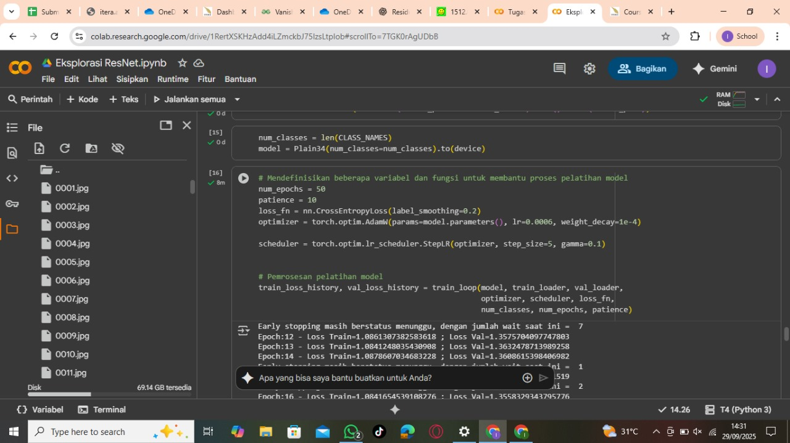
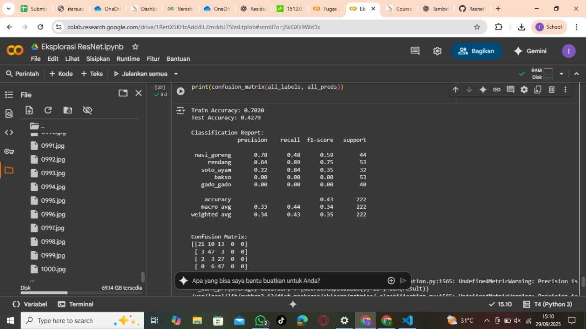
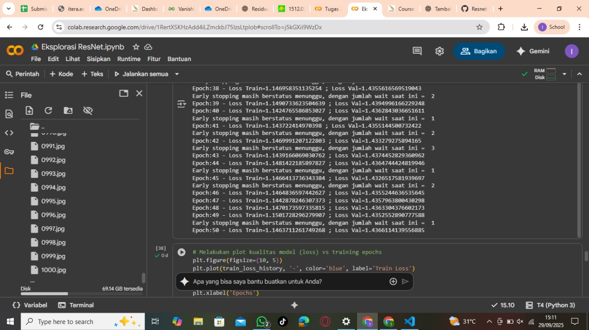
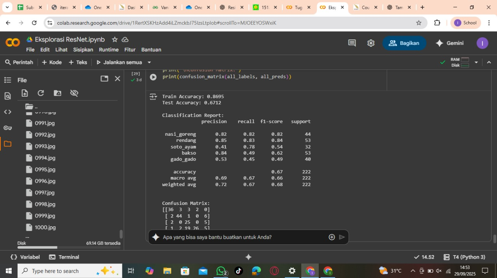
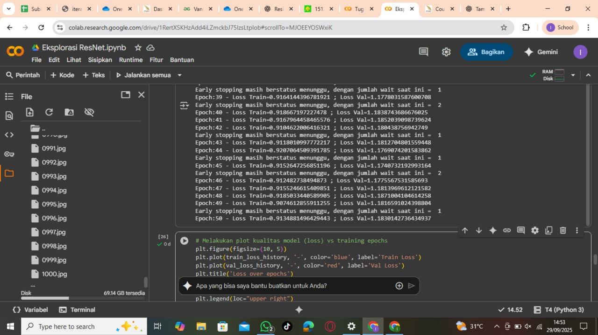
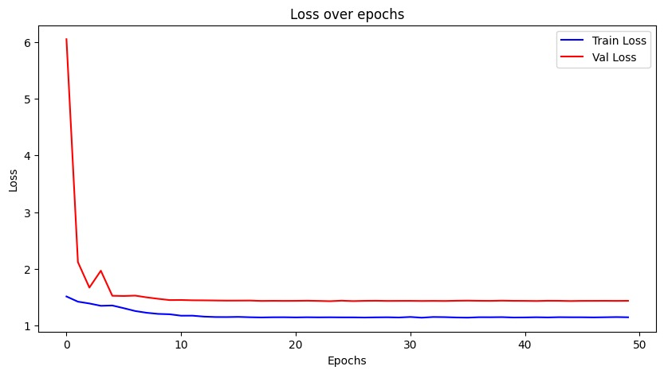
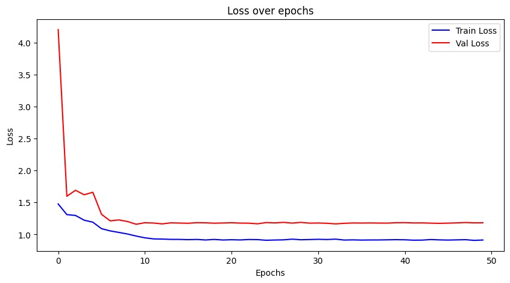

# TUGAS EKPLORASI RESNET-34
# DEEP LEARNING RB
# NASGOR GORENG
# AHMAD FAQIH HASANI 122140005
# REYNALDI CRISTIAN SIMAMORA 122140116

---

#### Konfigurasi Hyperparameter

Dalam pelatihan kedua model, konfigurasi hyperparameter yang digunakan dijelaskan sebagai berikut. Jumlah kelas target (num_classes) disesuaikan dengan panjang daftar CLASS_NAMES, dan model dilatih selama 50 epoch (num_epochs=50). Early stopping dengan patience=10 digunakan untuk menghentikan pelatihan jika tidak ada perbaikan pada validation loss selama 10 epoch berturut-turut. Fungsi loss yang digunakan adalah CrossEntropyLoss dengan label_smoothing=0.2, yang mencegah model terlalu yakin pada prediksi yang salah. Optimizer yang dipilih adalah AdamW dengan learning rate lr=0.0006 dan weight decay weight_decay=1e-4, yang membantu dalam pembaruan bobot model dan mengurangi overfitting. Selain itu, learning rate scheduler StepLR mengurangi learning rate setiap 5 epoch (step_size=5) dengan faktor pengurangan gamma=0.1, memungkinkan model untuk belajar lebih cepat di awal dan memperlambat pembelajaran pada epoch terakhir. Kombinasi hyperparameter ini bertujuan untuk membuat pelatihan lebih efisien, menghindari overfitting, dan memastikan model dapat mencapai performa terbaik pada data validasi. Untuk batch_size (batch_size = 50), nilai ini dipilih agar mampu menyimpan 50 sampel dalam satu iterasi pembaruan bobot, memberikan keseimbangan antara penggunaan memori dan kecepatan pemrosesan. Penggunaan batch size yang lebih besar memungkinkan pemanfaatan GPU secara lebih optimal, meningkatkan stabilitas pembaruan bobot dengan rata-rata gradien yang dihitung dari sejumlah sampel lebih besar, dan mempercepat proses pelatihan tanpa mengorbankan kualitas pembelajaran.

---

#### Tabel Perbandingan Metrik Dua Model
##### Hasil dari Model Plain-34

#### Hasil Evaluasi Model

Berikut adalah hasil evaluasi model pada data latih dan data uji yang dilakukan setelah proses pelatihan.

#### Classification Report

| **Kelas**      | **Precision** | **Recall** | **F1-Score** | **Support** |
|----------------|---------------|------------|--------------|-------------|
| nasi_goreng    | 0.78          | 0.48       | 0.59         | 44          |
| rendang        | 0.64          | 0.89       | 0.75         | 53          |
| soto_ayam      | 0.22          | 0.84       | 0.35         | 32          |
| bakso          | 0.00          | 0.00       | 0.00         | 55          |
| gado_gado      | 0.00          | 0.00       | 0.00         | 50          |
| **accuracy**   |               |            | **0.43**     | 222         |
| **macro avg**  | 0.33          | 0.44       | 0.34         | 222         |
| **weighted avg**| 0.34         | 0.43       | 0.35         | 222         |

#### Akurasi Model

- **Train Accuracy**: 0.7020
- **Test Accuracy**: 0.4279

#### Hasil Train Model Plain-34

---

##### Hasil dari Model Resnet-34

#### Hasil Evaluasi Model

Berikut adalah hasil evaluasi model pada data latih dan data uji yang dilakukan setelah proses pelatihan.

#### Classification Report

| **Kelas**      | **Precision** | **Recall** | **F1-Score** | **Support** |
|----------------|---------------|------------|--------------|-------------|
| nasi_goreng    | 0.82          | 0.82       | 0.82         | 44          |
| rendang        | 0.85          | 0.83       | 0.84         | 53          |
| soto_ayam      | 0.41          | 0.62       | 0.49         | 32          |
| bakso          | 0.54          | 0.49       | 0.52         | 55          |
| gado_gado      | 0.53          | 0.45       | 0.49         | 50          |
| **accuracy**   |               |            | **0.67**     | 222         |
| **macro avg**  | 0.69          | 0.67       | 0.67         | 222         |
| **weighted avg**| 0.72         | 0.67       | 0.68         | 222         |

#### Akurasi Model

- **Train Accuracy**: 0.8695
- **Test Accuracy**: 0.6712
- 
#### Hasil Train Resnet-34

---

#### GRAFIK KURVA TRAINING KEDUA MODEL
##### Grafik Train dari Model Plain-34

##### Grafik Train dari Model Resnet-34

#### HASIL ANALISIS

Hasil pengujian menunjukkan adanya perbedaan yang cukup signifikan antara model Plain34 dan ResNet34 dengan skip connection. Pada model Plain34, diperoleh akurasi pelatihan sebesar 70,2% dan akurasi pengujian sebesar 42,8%. Selisih yang cukup besar antara kedua nilai ini mengindikasikan terjadinya overfitting. Selain itu, pada laporan klasifikasi terlihat bahwa beberapa kelas, seperti gado-gado, tidak dapat dikenali dengan baik oleh model. Hal ini sejalan dengan karakteristik jaringan yang semakin dalam tanpa adanya mekanisme residual, sehingga gradien sulit mengalir ke lapisan awal (vanishing gradient), yang pada akhirnya membatasi kemampuan model dalam melakukan pembelajaran secara optimal.

Sebaliknya, pada ResNet34 yang dilengkapi dengan skip connection, diperoleh akurasi pelatihan sebesar 86,9% dan akurasi pengujian sebesar 67,1%. Hasil ini menunjukkan peningkatan performa yang signifikan dibandingkan Plain34, baik dari sisi akurasi maupun distribusi prediksi antar kelas. ResNet34 mampu mengenali seluruh kelas dengan lebih merata, termasuk kelas yang sebelumnya sulit dikenali seperti soto_ayam dan gado-gado. Mekanisme residual connection terbukti membantu mempertahankan aliran gradien pada jaringan yang dalam, sehingga setiap lapisan dapat terlatih dengan lebih baik.

Secara keseluruhan, perbandingan ini menunjukkan bahwa penggunaan arsitektur residual memberikan kontribusi positif. ResNet34 tidak hanya meningkatkan akurasi pelatihan dan pengujian, tetapi juga menghasilkan model dengan generalisasi yang lebih baik serta lebih stabil dibandingkan Plain34.

---

