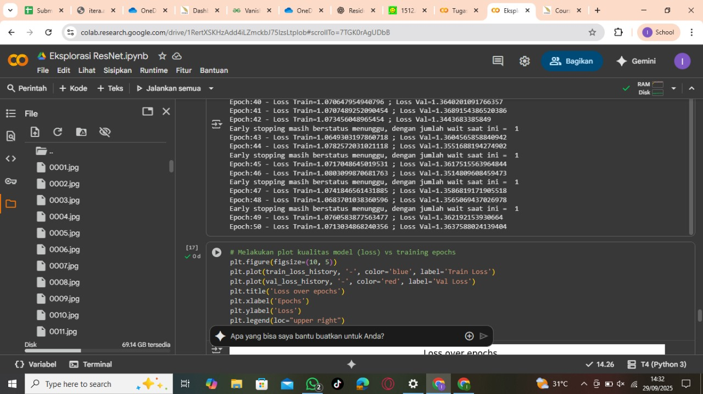

---
TUGAS EKPLORASI RESNET-34
DEEP LEARNING RB
NASGOR GORENG
AHMAD FAQIH HASANI 122140005
REYNALDI CRISTIAN SIMAMORA 122140116

---

#### Konfigurasi Hyperparameter

Dalam pelatihan kedua model, konfigurasi hyperparameter yang digunakan dijelaskan sebagai berikut. Jumlah kelas target (num_classes) disesuaikan dengan panjang daftar CLASS_NAMES, dan model dilatih selama 50 epoch (num_epochs=50). Early stopping dengan patience=10 digunakan untuk menghentikan pelatihan jika tidak ada perbaikan pada validation loss selama 10 epoch berturut-turut. Fungsi loss yang digunakan adalah CrossEntropyLoss dengan label_smoothing=0.2, yang mencegah model terlalu yakin pada prediksi yang salah. Optimizer yang dipilih adalah AdamW dengan learning rate lr=0.0006 dan weight decay weight_decay=1e-4, yang membantu dalam pembaruan bobot model dan mengurangi overfitting. Selain itu, learning rate scheduler StepLR mengurangi learning rate setiap 5 epoch (step_size=5) dengan faktor pengurangan gamma=0.1, memungkinkan model untuk belajar lebih cepat di awal dan memperlambat pembelajaran pada epoch terakhir. Kombinasi hyperparameter ini bertujuan untuk membuat pelatihan lebih efisien, menghindari overfitting, dan memastikan model dapat mencapai performa terbaik pada data validasi. Untuk batch_size (batch_size = 50), nilai ini dipilih agar mampu menyimpan 50 sampel dalam satu iterasi pembaruan bobot, memberikan keseimbangan antara penggunaan memori dan kecepatan pemrosesan. Penggunaan batch size yang lebih besar memungkinkan pemanfaatan GPU secara lebih optimal, meningkatkan stabilitas pembaruan bobot dengan rata-rata gradien yang dihitung dari sejumlah sampel lebih besar, dan mempercepat proses pelatihan tanpa mengorbankan kualitas pembelajaran.

#### Tabel Perbandingan Metrik Dua Model

#### GRAFIK KURVA TRAINING KEDUA MODEL

#### HASIL ANALISIS

